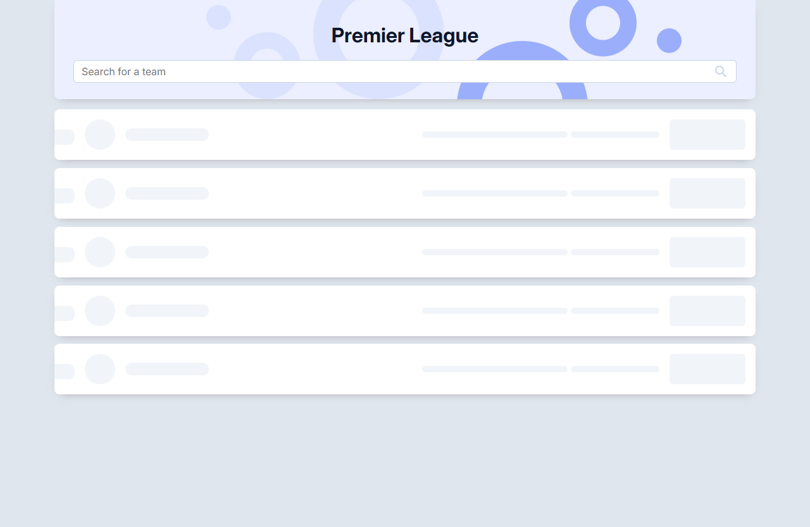
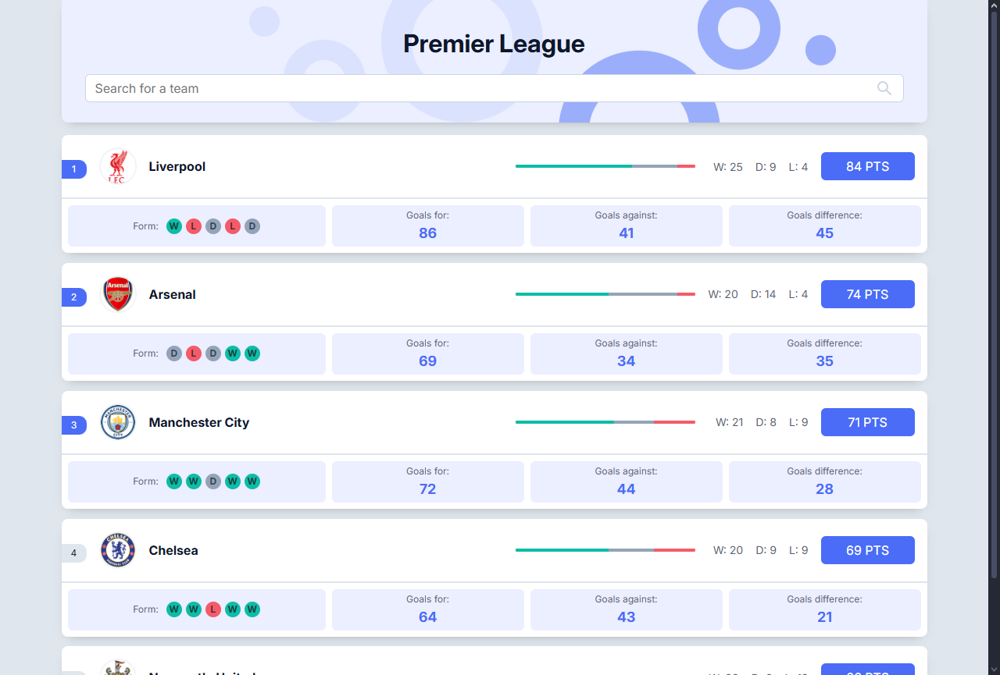
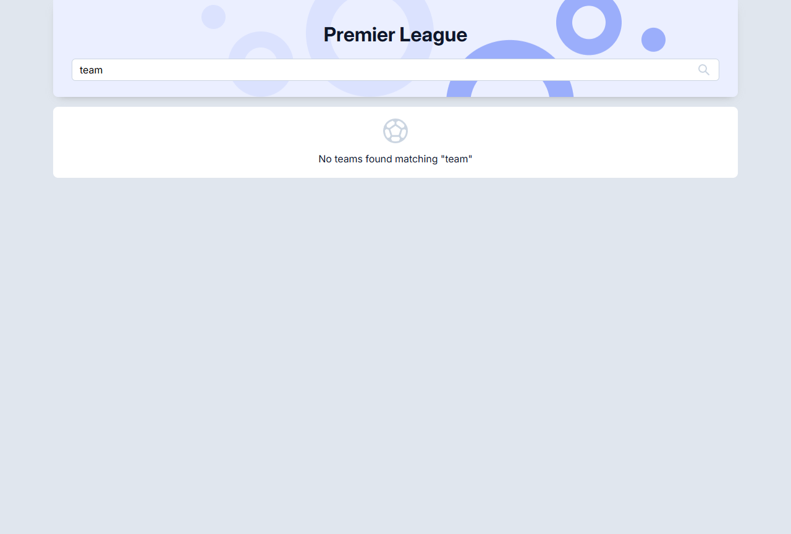
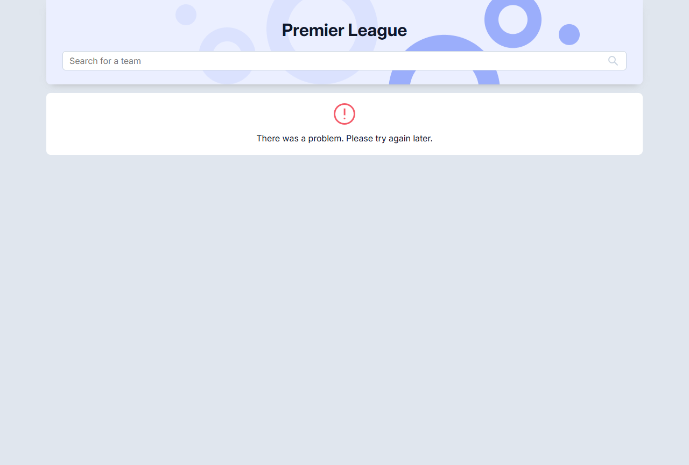

## Zadanie rekrutacyjne Johnnybros

### Na stanowisko Frontend Developer

Do uruchomienia zadania potrzebny jest [Node.js](https://nodejs.org/en/download).

Po zainstalowaniu Node.js należy użyć komend:

1. `npm install`
2. `npm run dev`

### Screenshots

